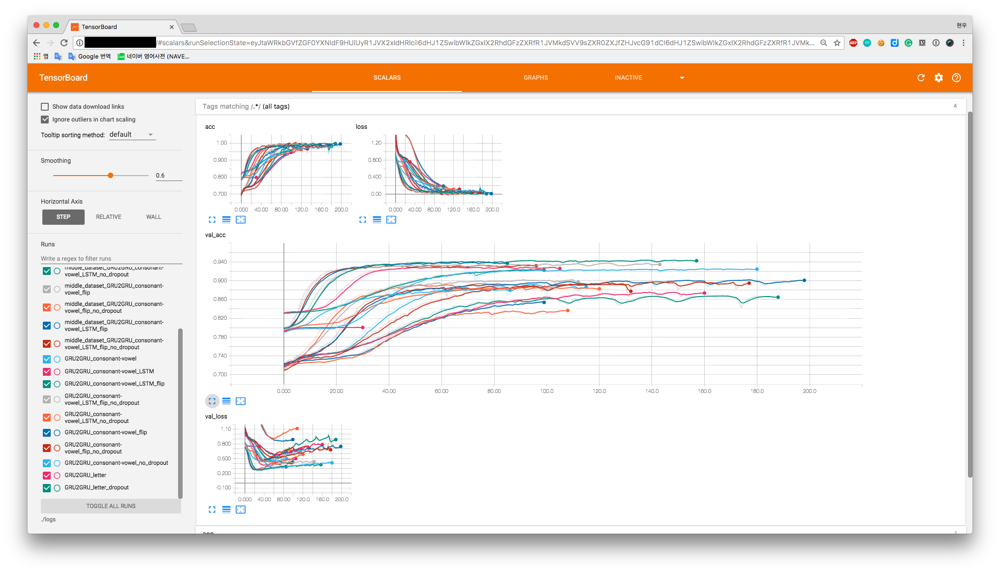

# English2Korean - Experiments


## Experiments file header
- GRU2GRU : Project name
- consonant-vowel : Use consonant and vowel to make output
- flip : Flip the input of the models
- no_dropout : Not used `dropout` layer for `decoder`
- LSTM : Use `LSTM` for `encoder`

FYI) `GRU2GRU_consonant-vowel_LSTM_flip` has the best accuracy  


## Tensorboard
If you want to see the graphs, check the `results` or use :
```bash
$ tensorboard --logdir=./log
```

then you can see  

